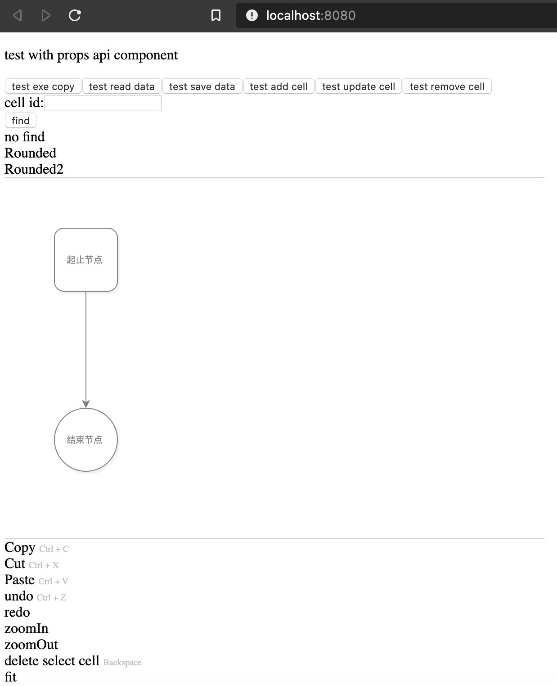

# react-mxgraph

## Quick start

`npm run dev`

Start local web server on port 8080 and launches app in web browser:

## Design

The code is written in TypeScript using React 16 as the framework.

### MxGraph

The `MxGraph` component controls the mxgraph diagram. 
Main functionalities: 

- undo manager
- ...

The graph adds a MouseListener via `addMouseListener` which sets up handlers for various mouse events.
Furthermore action handlers are defined for:

- cut (Ctrl-X)
- copy (Ctrl-C)
- paste (Ctrl-V)
- undo (Ctrl-Z)
- redo
- zoom in
- zoom out
- delete cell
- fit